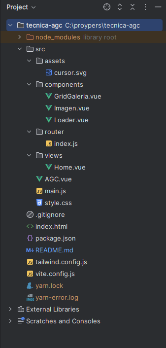
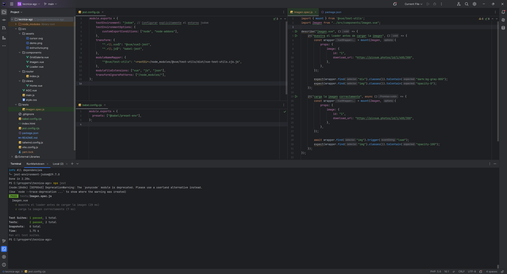

# Técnica AGC - Galería de Imágenes 🌌

Una galería de imágenes responsiva y optimizada, desarrollada con **Vue 3** y **Tailwind CSS**, cumpliendo con las especificaciones técnicas de la prueba solicitada.

---

## 🖼️ Descripción del Proyecto
Este proyecto consiste en una galería de imágenes dinámica con las siguientes características:

- **Carga inicial de imágenes:** Las imágenes se cargan automáticamente al abrir la página.
- **Scroll infinito:** Más imágenes se cargan automáticamente al llegar al final de la página.
- **Eliminación de imágenes:** Cada imagen puede eliminarse al hacer clic en ella, reorganizando las restantes de forma suave.
- **Transiciones fluidas:** Se aplican animaciones para reorganizar y cargar imágenes de manera visualmente agradable.
- **Experiencia optimizada:** Placeholder y loader personalizados para garantizar una navegación sin cortes.
- **Botón "Ir arriba":** Un botón flotante que facilita la navegación al inicio de la página.

---

## 📸 Tecnologías Utilizadas
- **Framework:** Vue 3
- **Estilos:** Tailwind CSS
- **Petición de datos:** Axios
- **Lazy Loading:** Implementación manual para mejorar el rendimiento
- **Transiciones:** Vue Transition Group para animaciones fluidas

---

## 🚀 Cómo Probar Localmente

Sigue los pasos a continuación para ejecutar el proyecto en tu máquina local:

### 1️⃣ Clonar el repositorio
```bash
git clone https://github.com/iamcordobes/tecnica-agc
cd tecnica-agc
```

### 2️⃣ Instalar las dependencias (Asegúrate de tener Node.js (v16 o superior) y yarn instalados en tu máquina.)
```bash
yarn install
```

### 3️⃣ Ejecutar el servidor de desarrollo
```bash
yarn dev
```

## 📋 Estructura del Proyecto


## Visualizacion General


## Prueba Jest
